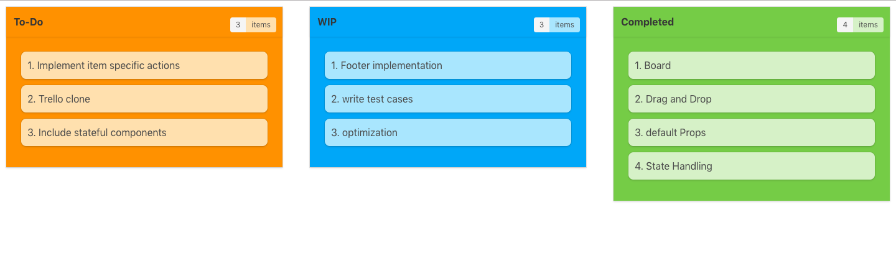

# react-bulma-board

> Create boards to display lists and also drag and drop items back and forth while maintaing the state of the lists.



## Installation

```
npm i react-bulma-board --save
```

## Sample Code

```
import React, { Component } from "react";
import { render } from "react-dom";
import { DragAndDropBoard } from "react-bulma-board";
import "./bulma.css";

class App extends Component {
  constructor(props) {
    super(props);
    this.state = {
      boardContent: {
        "To-Do": [
          "Implement item specific actions",
          "Trello clone",
          "Include stateful components"
        ],
        WIP: ["Footer implementation", "write test cases", "optimization"],
        Completed: ["Board", "Drag and Drop", "default Props", "State Handling"]
      },
      options: {
        boardColors: ["#FF9800", "#03A9F4", "#8BC34A"],
        innerItemColor: ["#FFE0B2", "#B3E5FC", "#DCEDC8"],
        roundedCorner: true,
        innerItemsRoundedCorner: true,
        showKeyIndex: true
      }
    };
  }

  handleState(data) {
    this.setState({
      data
    });
  }

  render() {
    const { boardContent, options } = this.state;
    return (
      <DragAndDropBoard
        numberOfBoards={3}
        boardContent={boardContent}
        onDrop={data => this.handleState(data)}
        options={options}
      />
    );
  }
}

render(<App />, document.getElementById("root"));
```

## Props

| name           | type   | required | description                                                                  |
| -------------- | ------ | -------- | ---------------------------------------------------------------------------- |
| numberOfBoards | Number | true     | The number of boards to be displayed                                         |
| boardContent   | Object | true     | Lists to be passed on to the boards are to be represented in key-value pairs |
| options        | Object | true     | Display options, explained in the next section.                              |

## Options

| name                     | type    | required | description                                                                   | exampleValue                        | defaultValue |
| ------------------------ | ------- | -------- | ----------------------------------------------------------------------------- | ----------------------------------- | ------------ |
| boardColors              | array   | false    | Board's background color, applied to each board in the passed order           | `["#FF9800", "#03A9F4", "#8BC34A"]` | `#fff`       |
| innerItemColor           | array   | false    | Inner list item's background color, applied to each board in the passed order | `["#FFE0B2", "#B3E5FC", "#DCEDC8"]` | `#fff`       |
| roundedCorners           | boolean | false    | Toggle between rounded corners                                                | true                                | `false`      |
| innerItemsroundedCorners | boolean | false    | Toggle between rounded corners                                                | true                                | `false`      |
| showKeyIndex             | boolean | false    | Make the list items as numbered lists                                         | true                                | `false`      |

## Release History

- 0.1.0
  - Render Boards | Stateful List Items | Drag and Drop List Items

## Author

Raghavendran Ramesh (_BeardDude_)

-ramesh.raghaven@gmail.com

Distributed under the MIT license. See `LICENSE` for more information.

## License

MIT License

## References

This component has been created only because of the availability of some cool references that are listed below,

1. Polyfills for touch devices - <https://github.com/Bernardo-Castilho/dragdroptouch>
2. Bulma - <https://www.bulma.io>
3. Drag and Drop Implementation - https://github.com/rajeshpillai/youtube-react-components/blob/master/src/AppDragDropDemo.js
